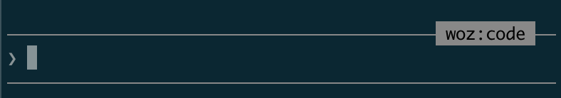

# WOZCODE Plugin for Claude Code

Smarter tools for Claude Code that reduce token usage and cost. Replaces built-in file tools with optimized alternatives — fewer tokens per tool call means cheaper sessions that compound over time.

## Getting Started

### 1. Install

From GitHub — inside a Claude Code session, run:

```
/plugin marketplace add WithWoz/wozcode-plugin
/plugin install woz@wozcode-marketplace
```

### 2. Restart Claude Code

Quit your current session and start a new one:

```bash
claude
```

### 3. Verify it's working

Look for **`woz:code`** on the right side of the text input field:



That badge means the WOZCODE agent is active.

### 4. Log in

WOZCODE requires a Woz account. On first tool use you'll be prompted to log in, or do it explicitly:

```
/woz-login
```

Or type `/woz` to see all available WOZCODE commands.

This opens your browser to complete sign-in. Credentials are saved and refreshed automatically.

**Headless / SSH?** The terminal prints an auth URL. Open it manually, complete login, copy the token JSON from the success page, and paste it back:

```
/woz-login --token '{"access_token":"...","refresh_token":"..."}'
```

## Usage

Just use Claude Code normally — WOZCODE tools activate automatically. The plugin replaces built-in file tools with smarter versions behind the scenes.

### Agents

| Agent | What it does |
|-------|--------------|
| `woz:code` | Main agent — coding, editing, search, SQL. Auto-delegates to the others when useful. |
| `woz:explore` | Fast read-only codebase exploration (runs on haiku for speed) |
| `woz:plan` | Architecture and implementation planning (runs on haiku for speed) |

You don't need to switch agents manually. `woz:code` delegates to `woz:explore` and `woz:plan` as subagents when it makes sense.

### Commands

| Command | Description |
|---------|-------------|
| `/woz-login` | Log in to your Woz account |
| `/woz-logout` | Clear credentials |
| `/woz-recall` | Recall saved context and preferences |
| `/woz-status` | Check authentication status |
| `/reload-plugins` | Reload plugins to get latest updates |

You can also type `/woz` to see all available WozCode commands in one place.

## Managing the plugin

```
/plugin disable woz@wozcode-marketplace     # temporarily disable
/plugin enable woz@wozcode-marketplace      # re-enable
/plugin marketplace remove WithWoz/wozcode-plugin   # remove
```

### Updating

To get the latest version:

```
/reload-plugins
```

If you need to fully reinstall:

```
/plugin marketplace remove WithWoz/wozcode-plugin
/plugin marketplace add WithWoz/wozcode-plugin
/plugin install woz@wozcode-marketplace
```

### Debug

To explicitly launch with the WOZCODE agent (not normally needed):

```bash
claude --agent woz:code
```
